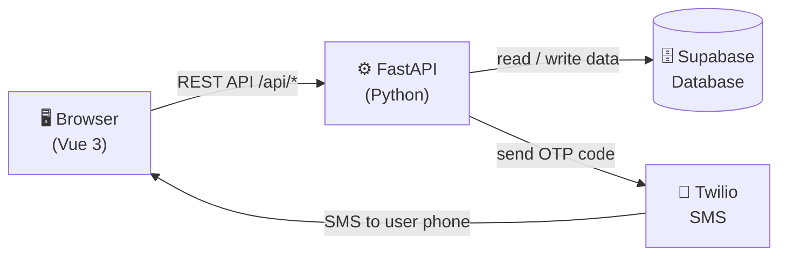

# 鮮採市集 · Fresh Harvest Market

An online fruit and vegetable marketplace built with Vue 3, FastAPI, and Supabase.

---

## How It All Connects



---

## Setup

### Backend

```bash
cd backend
python3 -m venv .venv
source .venv/bin/activate        # Windows: .venv\Scripts\activate
pip install -r requirements.txt
uvicorn app.main:app --reload --port 8000
```

### Frontend

```bash
cd frontend
npm install
npm run dev
```

Backend runs on `localhost:8000`, frontend on `localhost:5173`.

---

## Frontend Files (`frontend/src/`)

### Views — one file per page

| File | What it does |
|------|-------------|
| `views/HomePage.vue` | Landing page with featured products and flash sales |
| `views/ShopPage.vue` | Full product catalogue with category filters |
| `views/ProductPage.vue` | Single product detail and add-to-cart |
| `views/CheckoutPage.vue` | Order form — name, phone, address, and cart summary |
| `views/LoginPage.vue` | Login form and SMS password reset flow |
| `views/RegisterPage.vue` | New account registration |
| `views/AboutPage.vue` | About the market |
| `views/ContactPage.vue` | Contact information |

### Components — reusable UI pieces

| File | What it does |
|------|-------------|
| `components/layout/HeaderNav.vue` | Top navigation bar with cart icon and login state |
| `components/layout/AppLayout.vue` | Page wrapper that all views sit inside |
| `components/layout/SearchPanel.vue` | Search overlay |
| `components/product/ProductCard.vue` | Product thumbnail used on the shop and home pages |
| `components/product/PriceDisplay.vue` | Shows price with optional strikethrough compare price |
| `components/cart/CartDrawer.vue` | Slide-out cart panel |
| `components/cart/QuantityStepper.vue` | + / − quantity control inside the cart |
| `components/ui/BaseButton.vue` | Shared button style used site-wide |
| `components/ui/ToastHost.vue` | Notification pop-ups (e.g. "Added to cart") |

### Stores — global state (Pinia)

| File | What it holds |
|------|--------------|
| `stores/auth.js` | Logged-in user, token, login/logout actions |
| `stores/cart.js` | Cart items, totals, sync with backend |
| `stores/catalog.js` | Products and categories fetched from API |
| `stores/ui.js` | Cart drawer open/close, modal state |
| `stores/toast.js` | Toast notification queue |

### Other

| File | What it does |
|------|-------------|
| `router/index.js` | Maps URLs to views; redirects to login if checkout requires auth |
| `main.js` | Boots the Vue app and registers plugins |
| `App.vue` | Root component |

---

## Backend Files (`backend/app/`)

| File | What it does |
|------|-------------|
| `main.py` | Creates the FastAPI app, registers all routers, serves the built frontend |
| `schemas.py` | Pydantic models that define the shape of data (Product, Order, etc.) |
| `supabase_config.py` | Opens the Supabase database connection |
| `routers/auth.py` | Register, login, logout, profile update, cart sync, SMS password reset |
| `routers/products.py` | List all products, get a single product by ID |
| `routers/categories.py` | List product categories |
| `routers/orders.py` | Create an order, fetch order history |
| `routers/flash_sales.py` | Return the current flash sale items |

---

## Environment Variables

Create `backend/.env` for SMS password reset:

```
TWILIO_ACCOUNT_SID=ACxxxxxxxxxxxxxxxxxxxxxxxxxxxxxxxx
TWILIO_AUTH_TOKEN=xxxxxxxxxxxxxxxxxxxxxxxxxxxxxxxx
TWILIO_PHONE_NUMBER=+1xxxxxxxxxx
```

---

## Troubleshooting

| Problem | Fix |
|---------|-----|
| Python not found | Mac: `brew install python@3.12` · Windows: reinstall from python.org and check "Add to PATH" |
| `pip install` fails | Run `pip install --upgrade pip` first |
| PowerShell blocks activate | Run `Set-ExecutionPolicy RemoteSigned -Scope CurrentUser` |
| Frontend can't reach backend | Make sure backend is running on port 8000 |
| SMS not sending | Check `backend/.env` has valid Twilio credentials |
